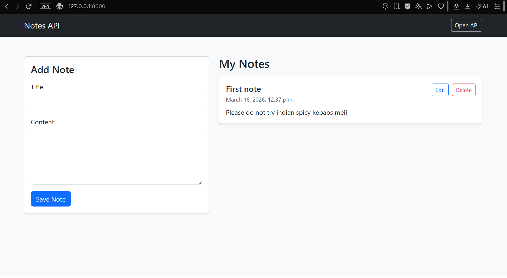

# Notes API

Simple note management application built with Django and Django REST Framework.

Features:
- Create notes
- Edit notes
- Delete notes
- REST API
- Simple Bootstrap interface

Tech stack:
- Python
- Django
- Django REST Framework
- SQLite
- Bootstrap

Run project:

python -m venv venv
venv\Scripts\activate
pip install -r requirements.txt
python manage.py migrate
python manage.py runserver

## API Endpoints

GET /api/notes/ – list notes  
POST /api/notes/ – create note  
PUT /api/notes/{id}/ – update note  
DELETE /api/notes/{id}/ – delete note

## API example (screenshots)

## Author
- Realsnubs